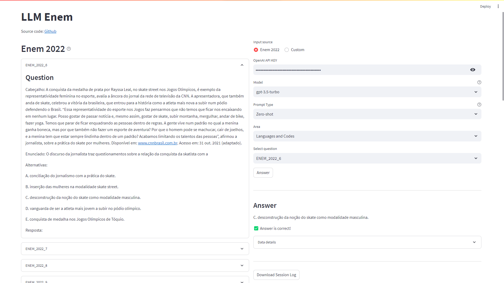

<br />
<div align="center">
  <a href="https://github.com/viniciusarruda/llm-enem/">
    
  </a>
  <!-- <p align="center" >Source: <a href="https://download.inep.gov.br/enem/provas_e_gabaritos/2022_PV_impresso_D1_CD3.pdf">Enem 2020 - 1º Dia - Caderno 3</a></p> -->
  <h3 align="center">Solving the Enem exam with LLMs<br/><a href="https://llm-enem.streamlit.app/">Live Demo</a></h3>
</div>

## About

This repository aims to run LLMs on the [Enem](https://www.gov.br/inep/pt-br/areas-de-atuacao/avaliacao-e-exames-educacionais/enem), a Brazilian University Admission Exam.

Currently, the repository aims to replicate the results from the paper [Evaluating GPT-3.5 and GPT-4 Models on Brazilian University Admission Exams
](https://arxiv.org/abs/2303.17003) for the dataset they have [relased](https://github.com/piresramon/gpt-4-enem/tree/main/data/enem), named `ENEM 2022`.

The code was written aiming to have few dependencies and facilitate the use of LLMs other than OpenAI-based ones.

## Dataset

### ENEM 2022
The `ENEM 2022` dataset is available under the folder `dataset/enem` in a processed format ready to use with the LLMs. The processing procedure was done taking into consideration the [instructions](https://github.com/piresramon/gpt-4-enem/issues/1) given by the author with little modification. In order to replicate it, replace the original `write_out.py` file with the `dataset/enem/write_out.py` file.

<!-- For the three-shot formats, it was observed that three prompts have only two examples instead of three, and their ids are: `ENEM_2022_21`, `ENEM_2022_88`, and `ENEM_2022_143`. This issue has been [reported](https://github.com/piresramon/gpt-4-enem/issues/1) to the author. --> 

The original Enem exam used to build the `ENEM 2022` dataset can be downloaded [here](https://download.inep.gov.br/enem/provas_e_gabaritos/2022_PV_impresso_D1_CD3.pdf) and [here](https://download.inep.gov.br/enem/provas_e_gabaritos/2022_PV_impresso_D2_CD6.pdf).


## Installation

Note: 
> This project was developed using `Windows 11` with `python 3.10.9`.


Clone this repository, create a new environment (recommended) and install the dependencies:

```bash
pip install -r requirements.txt
```

## Usage

### Evaluate on OpenAI LLMs

#### 1. Set the OpenAI API key:
Visit [OpenAI](https://help.openai.com/en/articles/4936850-where-do-i-find-my-secret-api-key) to retrieve your API key and add to your environment variable.

On Windows:
```powershell
$Env:OPENAI_API_KEY="sk-xxxxxxxxxxxxxxxxxxxxxxxxxxxxxxxxxxxxxxxxxxxxxxxx"
```

On Linux:
```bash
export OPENAI_API_KEY="sk-xxxxxxxxxxxxxxxxxxxxxxxxxxxxxxxxxxxxxxxxxxxxxxxx"
```

#### 2. Run the evaluation script:

You can run with any model starting with `gpt-3.5-turbo` and `gpt-4`. 
The results reported in this repository are the [`gpt-3.5-turbo-0613`](https://platform.openai.com/docs/models/gpt-3-5) and [`gpt-4-0613`](https://platform.openai.com/docs/models/gpt-4) versions.

For the dataset, the options are: `Zero-shot`, `Few-shot`, and `Few-shot with Chain-of-Thought`, which evaluates the dataset files `enem_2022_0_shot.json`, `enem_2022_3_shot.json`, and `enem_cot_2022_3_shot.json`, respectively.

```powershell
python evaluator.py evaluate --models "['gpt-3.5-turbo-0613', 'gpt-4-0613']" --dataset_names "['Zero-shot', 'Few-shot', 'Few-shot with Chain-of-Thought']"
```

The results will be placed in the `reports` folder (beware, this will overwrite the current files).
To produce the `results.html` file with a summary table as in the [results section](#results), run:

```powershell
python evaluator.py build_results_table --models "['gpt-3.5-turbo-0613', 'gpt-4-0613']" --dataset_names "['Zero-shot', 'Few-shot', 'Few-shot with Chain-of-Thought']"
```

### Evaluate on LLMs hosted on HuggingFace via Inference Endpoints

#### 1. Create a HuggingFace Inference Endpoint

Select a LLM from the Hugging Face [model hub](https://huggingface.co/models?pipeline_tag=text-generation&sort=trending).

This repository was tested with the following models:

- [tiiuae/falcon-7b-instruct](https://huggingface.co/tiiuae/falcon-7b-instruct)
- [tiiuae/falcon-40b-instruct](https://huggingface.co/tiiuae/falcon-40b-instruct)
- [meta-llama/Llama-2-7b-chat-hf](https://huggingface.co/meta-llama/Llama-2-7b-chat-hf)
- [meta-llama/Llama-2-70b-chat-hf](https://huggingface.co/meta-llama/Llama-2-70b-chat-hf)

Create an endpoint at the [Hugging Face Inference Endpoint platform](https://huggingface.co/docs/inference-endpoints/guides/create_endpoint).

#### 2. Set the environment parameters:

Visit the [endpoint UI](https://ui.endpoints.huggingface.co/) to retrieve your token, name and url, and add to your environment variable:

```powershell
$Env:huggingface_token="hf_xxxxxxxxxxxxxxxxxx"
```

```powershell
$Env:huggingface_namespace="xxxxxxxxxxxxxxxxxx"
```

Using the `Falcon-7B` model as example, set the following environment variables using the following pattern:

```powershell
$Env:huggingface_Falcon7B_name="xxxxxxxxxxxxxxxxxx"
```

```powershell
$Env:huggingface_Falcon7B_url="https://xxxxxxxxxxxxxxxxxx.endpoints.huggingface.cloud"
```

#### 3. Run the evaluation script:

```powershell
python evaluator.py evaluate --models "['Falcon-7B', 'LLaMA-2-7B']" --dataset_names "['Zero-shot', 'Few-shot', 'Few-shot with Chain-of-Thought']"
```

```powershell
python evaluator.py build_results_table --models "['Falcon-7B', 'LLaMA-2-7B']" --dataset_names "['Zero-shot', 'Few-shot', 'Few-shot with Chain-of-Thought']"
```

### Streamlit Demo



The streamlit demo is only available for the OpenAI models.

```powershell
streamlit run streamlit_app.py
```

## Results

### GPT-3.5 and GPT-4 Models

[Evaluation](reports/results.html) on the `ENEM 2022` dataset, with the models `gpt-3.5-turbo-0613` and `gpt-4-0613`:

<table border="1px">
	<tr>
		<th rowspan=2>Area</th>
		<th colspan=3>gpt-3.5-turbo-0613</th>
		<th colspan=3>gpt-4-0613</th>
	</tr>
	<tr>
		<th>zero-shot</th>
		<th>three-shot</th>
		<th>three-shot<br>with CoT</th>
		<th>zero-shot</th>
		<th>three-shot</th>
		<th>three-shot<br>with CoT</th>
	</tr>
	<tr>
		<td>Languages and Codes</td>
		<td>25/33 (75.76%)</td>
		<td>28/33 (84.85%)</td>
		<td>25/33 (75.76%)</td>
		<td>30/33 (90.91%)</td>
		<td>29/33 (87.88%)</td>
		<td>30/33 (90.91%)</td>
	</tr>
	<tr>
		<td>Human Sciences</td>
		<td>34/37 (91.89%)</td>
		<td>33/37 (89.19%)</td>
		<td>33/37 (89.19%)</td>
		<td>35/37 (94.59%)</td>
		<td>36/37 (97.30%)</td>
		<td>35/37 (94.59%)</td>
	</tr>
	<tr>
		<td>Natural Sciences</td>
		<td>19/26 (73.08%)</td>
		<td>19/26 (73.08%)</td>
		<td>19/26 (73.08%)</td>
		<td>20/26 (76.92%)</td>
		<td>22/26 (84.62%)</td>
		<td>21/26 (80.77%)</td>
	</tr>
	<tr>
		<td>Mathematics</td>
		<td>11/22 (50.00%)</td>
		<td>3/22 (13.64%)</td>
		<td>6/22 (27.27%)</td>
		<td>8/22 (36.36%)</td>
		<td>10/22 (45.45%)</td>
		<td>16/22 (72.73%)</td>
	</tr>
	<tr>
		<td>Total</td>
		<td>89/118 (75.42%)</td>
		<td>83/118 (70.34%)</td>
		<td>83/118 (70.34%)</td>
		<td>93/118 (78.81%)</td>
		<td>97/118 (82.20%)</td>
		<td>102/118 (86.44%)</td>
	</tr>
</table>

Detailed results can be seen in the [`reports`](reports/) folder.

### Falcon-7B and LLaMA-2-7B Models

The [evaluation](unreleased-reports/results.html) on the `ENEM 2022` dataset, with the models `Falcon-7B` and `LLaMA-2-7B`, was done using the Hugging Face Inference Endpoints. These models require a further investigation on how to build better prompts and how to automate the interpretation of their outputs. 
As can be seen in the detailed [`reports`](unreleased-reports/) folder, there are several issues, such as mixing english with portuguese, answering with gibberish text, and badly formatted answers. Thus, the [`results`](unreleased-reports/results.html) table **should not** be considered, being kept in the repository for informational purposes only.

## Citation

If you use the `ENEM 2022` dataset in your research, even the processed version released in this repository, please cite the [original work](https://github.com/piresramon/gpt-4-enem/tree/main#citation).

Also, if you use this code or the results published in this repository in your research, please cite:

```bibtex
@misc{arruda2023,
  author = {Vinicius Arruda},
  title = {Solving the Enem exam with LLMs},
  year = {2013},
  publisher = {GitHub},
  journal = {GitHub repository},
  howpublished = {\url{https://github.com/viniciusarruda/llm-enem}},
}
```


